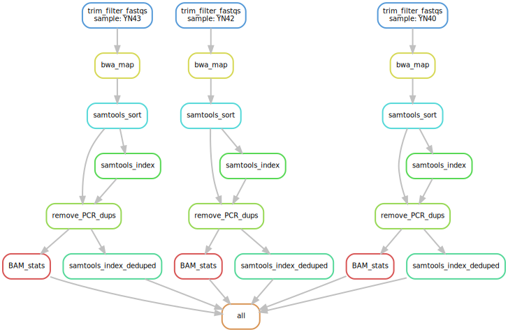

Modular snakemake pipeline for trimming & filtering short reads and mapping to a reference genome. I have tried to explain everything clearly in the comments, and below is a brief guide for those new to bioinformatics (e.g. Part II or 1-year master's students). I assume some knowledge of the command line, and use of the Cambridge HPC. If anything is not clear, please feel free to reach out to me either by raising an issue on this repo or by contacting me directly! :)

### Contents of this directory
**Components of the pipeline**
- `snakefile` - the snakefile that contains the overarching pipeline
- `rules/` - directory containing individual rules called by the snakefile
- `envs/` - directory containing YAML files with software requirements for particular rules
- `profiles/` - directory containing YAML files that control "default" resource use for each rule and how Snakemake interacts with the cluster

**Additional files**
- `README.md` - this README file
- `snakemake9_slurm.yml` - YAML file containing software dependencies for this pipeline
- `accessions2config.sh` - Bash script that takes a TSV file of SRR accessions and sample IDs as an input and returns a properly formatted snakemake config file. Use this to save time if you downloaded your sequencing data from NCBI using the scripts in [Download_NCBI](https://github.com/cd-williams/Handy-bioinformatics-scripts/tree/main/Download_NCBI). I will add a readme to it to explain its usage in the near future

### Anatomy of the snakemake pipeline
[Snakemake](https://snakemake.readthedocs.io/en/stable/) is a useful software tool for creating reproducible bioinformatics pipelines. An entire pipeline is contained in a single "snakefile", with each step defined as a [rule](https://snakemake.readthedocs.io/en/stable/snakefiles/rules.html) that takes a set of defined files as an input, processes them, and produces a set of defined output files. Based on the set of input and output files that you define for each rule, Snakemake is able to work out what order tasks need to be completed in, representing this information as a directed acyclic graph (example below):



If you want to get a better grasp of how Snakemake solves these dependencies, I would recommend this [tutorial](https://snakemake.readthedocs.io/en/stable/tutorial/tutorial.html#tutorial). 

There are three important components to this pipeline:
#### 1. The snakefile
(NOTE this is a brief high-level overview, the comments in the code will give you a line-by-line walkthrough)

The snakefile contains the overall workflow for this pipeline. It has a single "target" rule (`rule all:`) that defines what files we would like to have at the end of our pipeline. In this case, that's indexed BAM files for all our samples, as well as some stats files that contain information about the properties and quality of our alignment and processed reads.

We add individual rules to the snakefile using `include:`. This pulls the corresponding rules from `rules/` and integrates them into the snakefile. The modular nature of this setup means it is easy to chop and change rules. For example, if you wanted to use a different aligner other than `bwa`, you can easily write your own rule, save it to `rules/` and then call it in the snakefile. I plan to add support for other software in this pipeline as and when I need to.

#### 2. The profile
The profile is a YAML file that controls resource usage by each rule, as well as the resources (time, number of threads, and memory) allocated to each rule. There is a useful "default" profile in the profiles/ directory, but you may want to tweak this or create your own depending on your needs.

#### 3. The config file
The config file is a YAML file that contains all the information that Snakemake will use to build the filenames it uses in the inputs and outputs of the rules. It contains:

- Filepath for the reference genome:
```
reference: /path/to/reference/genome
```

- Prefixes for all the samples
```
prefix:
	sample1: sample1
	sample2: sample2
	...
```
(This is not very elegant but it means we catch and flag instances where you have forgotten to put in filepaths for all your samples if you create the config file manually)

- Filepaths for the forward reads for all the samples
```
forward:
	sample1: path/to/sample1/data/sample1_1.fq.gz
	sample2: path/to/sample2/data/sample2_1.fq.gz
	...
```

- Filepaths for the reverse reads for all the samples
```
reverse:
	sample1: path/to/sample1/data/sample1_2.fq.gz
	sample2: path/to/sample2/data/sample2_2.fq.gz
	...
```

If you have many samples, creating this file can be quite tedious and I would recommend automating it. If you used the scripts in [Download_NCBI](https://github.com/cd-williams/Handy-bioinformatics-scripts/tree/main/Download_NCBI), you can use `accessions2config.sh`.

### How to use the pipeline
#### 1. Setup
In your home directory, you can download this entire repo:
```
git clone https://github.com/cd-williams/Handy-bioinformatics-scripts
```

Then, you can recreate the required software environment using [Conda](https://anaconda.org/anaconda/conda) or similar package manager software. I personally have a preference for [Mamba](https://github.com/mamba-org/mamba) since it's a bit quicker and more lightweight. All the example code here assumes you are using Mamba, but you can easily use Conda instead.

```
mamba env create -f Handy-bioinformatics-scripts/Filter_map_reads/snakemake9_slurm.yml
```

This will create an environment called snakemake9 which you can activate using:
```
mamba activate snakemake9
```

Before running the pipeline, you will also need to create a config file (and also a snakemake profile if you don't want to use the default one provided in this repo).

#### 2. Checking the pipeline is behaving as expected

`cd` to the working directory where you want to run the pipeline.

First, I would recommend checking that the pipeline is going to behave as you expect. You can create a DAG that shows what the pipeline will do using:
```
snakemake --snakefile ~/Handy-bioinformatics-scripts/Filter_map_reads/snakefile --configfile /path/to/configfile/config.yaml | dot -Tsvg > DAG.svg
```

Inspect the DAG to make sure that the pipeline is behaving as you expect.

Next, I would recommend making sure that snakemake will submit rules to the cluster the way you expect. You can do this using using the `--dry-run` (`-n`) flag, which does a "mock" run of the pipeline without submitting anything to the cluster, and the `--printshellcmds` (`p`) flag, which will also print out the shell commands that would be submitted to the cluster.

I would recommend writing the output from this command to a file, and potentially running it in the background, for example:
```
nohup nice snakemake --np --snakefile ~/Handy-bioinformatics-scripts/Filter_map_reads/snakefile --configfile /path/to/configfile/config.yaml --profile /path/to/profile/ &
```

This will run the command in the background (`nohup`) without disrupting other HPC users' commands by being selfish with memory or threads (`nice`) and writes the output to `nohup.out`, which you can inspect to check everything will work the way you want it to.

NOTE that `--snakefile` and `--configfile` both take FILES as their input, while `--profile` takes a DIRECTORY. This directory must contain the YAML profile file. See `profiles/` for an example.

#### 3. Running the pipeline
Once you're satisfied that everything is behaving as expected, running the pipeline is straightforward. For example:

```
nohup nice snakemake --snakefile ~/Handy-bioinformatics-scripts/Filter_map_reads/snakefile --configfile /path/to/configfile/config.yaml --profile /path/to/profile/ &
```

Again the output text stream from Snakemake will go to `nohup.out`, which you can periodically inspect to see how things are going. You can use `squeue --me` to see how your jobs are getting on on the cluster.

To get an understanding for what this pipeline does, you might want to run it on a small subset of your samples (eg 2-3) before using it on your entire dataset. This can easily be done by creating a config file that only contains a small number of samples and running the pipeline using that.

#### 4. Troubleshooting
If a job fails, you will get an email (this is controlled by the profile) letting you know. Any remaining jobs that have already been submitted to the cluster will still run, but Snakemake will not submit any new jobs.

The email subject line will contain a Job_ID, which is a numerical ID the job was given when it was submitted to SLURM. Check in the Snakemake output (stored in `nohup.out` if you used the example code above) to see which sample and rule this job corresponds to.

If you accidentally delete `nohup.out`, or simply didn't set up the snakemake output to write to a file, don't worry. Snakemake also keeps its own logs, which you can find in `.snakemake/log/`. The files are named using the date and time they were run, so you can identify which file corresponds to your Snakemake run.

There are two reasons why a job might fail:

**1. Internal issue**

If the issue was because the software used in the corresponding rule couldn't process a file (for example say if a tool required a sorted BAM but you provided it with an unsorted BAM), this information will be stored in `/logs/rulename/samplename.log`. Check this file and see if anything went wrong, and then take steps to fix it.

**2. Cluster issue**

If the issue was with the cluster (for example running out of time or memory), this information will be contained in `.snakemake/slurm_logs/rule/`. If something like this was a problem, you can adjust the memory or time allocated to a rule by tweaking the profile.
